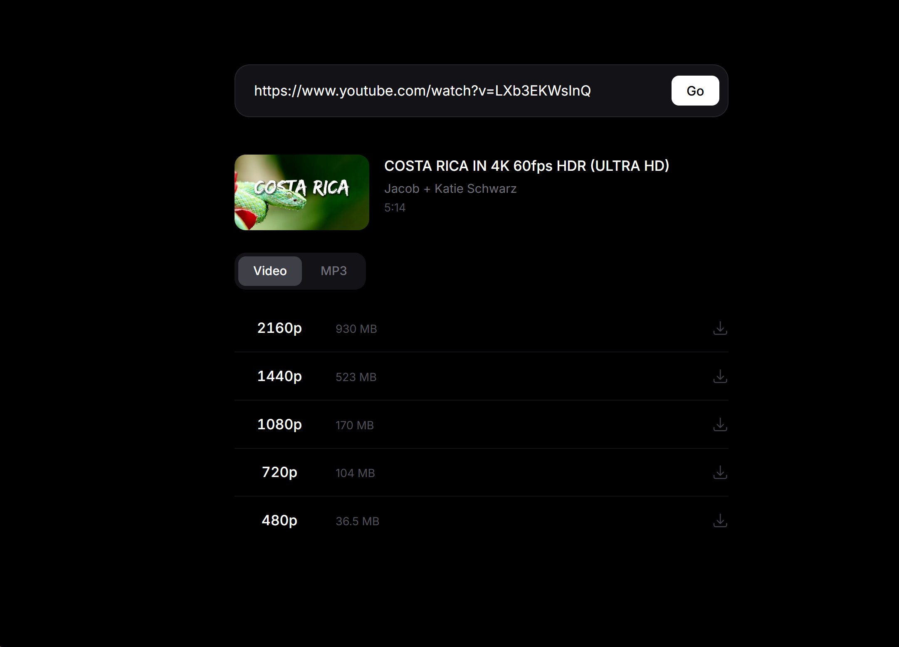
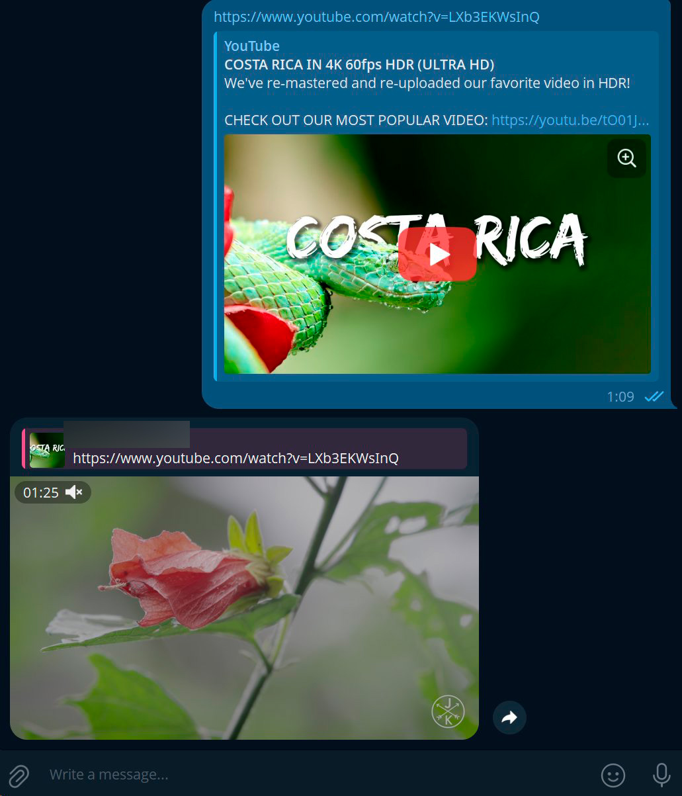

# YtDownload

**English** | **[Русский](README.ru.md)**

YouTube video and audio downloader with Web UI and Telegram Bot, running entirely in Docker.

### Features

- **Web UI** — minimalist dark interface, paste a link and download in one click
- **Video** — MP4 format, top 5 quality options, automatic audio+video merging
- **Audio** — MP3 download with quality selection
- **Real-time progress** — live progress bar showing each download stage
- **Telegram Bot** — send a YouTube link, get a video back (best quality up to 50 MB, ideal for Shorts)
- **Whitelist** — the first user to message the bot becomes the owner; all others are silently ignored
- **LAN access** — accessible from any device on your local network
- **No dependencies** — everything runs inside Docker (yt-dlp, ffmpeg, Go, nginx)

### Screenshots

| Web UI | Telegram Bot |
|---|---|
|  |  |

### Quick Start

**1. Clone**

```bash
git clone https://github.com/Gidroponik/YtDownload.git
cd YtDownload
```

**2. Configure**

```bash
cp .env.example .env
```

Edit `.env`:

```env
APP_PORT=3080
TELEGRAM_BOT=your_telegram_bot_token
TELEGRAM_OWNER=
```

| Variable | Description |
|---|---|
| `APP_PORT` | Port for the web interface (default: `3080`) |
| `TELEGRAM_BOT` | Telegram Bot API token from [@BotFather](https://t.me/BotFather). Leave empty to disable the bot |
| `TELEGRAM_OWNER` | Auto-filled after the first user writes to the bot. Do not set manually |

**3. Run**

```bash
docker compose up -d --build
```

**4. Open**

```
http://<your-ip>:<APP_PORT>
```

Example: `http://192.168.1.100:3080`

### Telegram Bot

If `TELEGRAM_BOT` is set in `.env`, a Telegram bot starts automatically alongside the app.

**How it works:**

1. Send any YouTube link to the bot
2. The bot finds the best MP4 quality that fits within Telegram's 50 MB limit
3. Downloads the video, merges audio, and sends the file back

> **Whitelist:** The first user to message the bot is automatically registered as the owner. Their `telegram_id` is saved to `.env` and persists across container restarts. All messages from other users are silently ignored.

### Architecture

```
┌──────────────┐    ┌──────────────┐
│   Frontend   │    │   Backend    │
│  Vue 3 +     │───▶│  Go (Gin)    │
│  nginx       │    │  yt-dlp      │
│  :80         │    │  ffmpeg      │
│              │    │  :8080       │
└──────────────┘    └──────┬───────┘
                           │
                    ┌──────▼───────┐
                    │ Telegram Bot │
                    │ (optional)   │
                    └──────────────┘
```

### Tech Stack

| Component | Technology |
|---|---|
| Backend | Go 1.22, Gin |
| Frontend | Vue 3, Vite, Tailwind CSS |
| Download engine | yt-dlp (standalone binary) |
| Audio/Video processing | ffmpeg |
| Telegram Bot | go-telegram-bot-api/v5 |
| Containerization | Docker, Docker Compose |
| Reverse proxy | nginx |

### License

MIT
